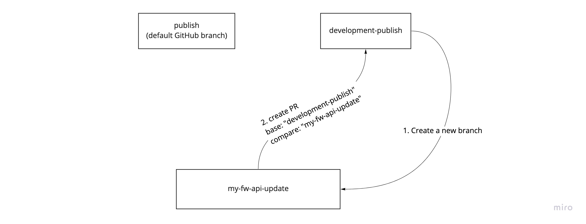
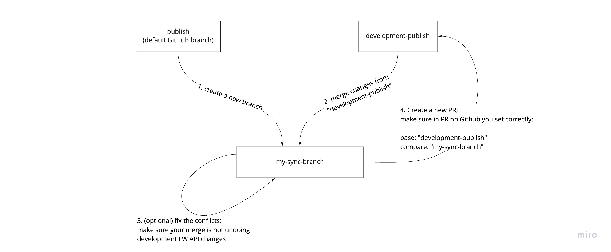
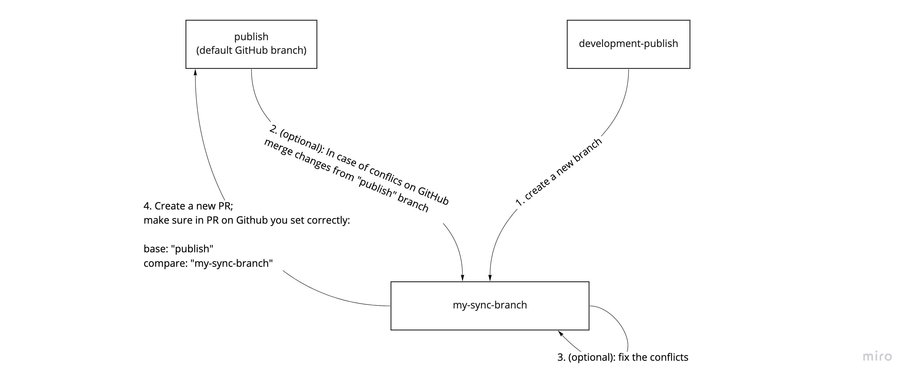

# Pycom documentation

Welcome to Pycom docs.

## Run locally

```
brew install hugo
hugo serve
```

## Github workflow

The default branch is `publish`. Changes pushed into this branch, will update [docs.pycom.io](https://docs.pycom.io/).

Second "live" branch is `development-publish` Changes pushed into this branch, will update [development.pycom.io](https://development.pycom.io)

Both `publish` and `development-publish` branches are protected. Changes cannot be pushed into them directly.
They require approved PR.

A webhook has been installed on the publish branch to
https://publish.d20i0wkqbblkur.amplifyapp.com/
https://github.com/pycom/pycom-documentation/tree/master

### Updating documentation pages (no development firmware API changes)
Use this workflow if you want to update documentation pages
(you are not updating pages with new development firmware API).

    $ git checkout publish
    $ git pull
    $ git checkout -b my-docs-update

After you push your changes to your branch, go to GitHub and create two pull requests.
So your branch is merged both to `publish` and `development-publish` branch.

After your pull request has been reviewed and merged both https://docs.pycom.io and https://development.pycom.io will be updated.    


### Adding development firmware API changes
This workflow will be probably done by someone from Pycom firmware development team.
In this case, Pycom development docs https://development.pycom.io/ needs to be updated with API changes from development firmware.

Note: we are running https://docs.pycom.io and https://development.pycom.io
When a user clicks on development dropdown on any firmware API change, he/she will be redirected to https://development.pycom.io

    $ git checkout development-publish
    $ git pull
    $ git checkout -b my-fw-api-update

After you push your changes to your branch,
go to GitHub and create a pull with **development-publish** branch as a base branch.    



### Adding changes from "publish" branch to "development-publish" branch
In this case, you want to sync "development" version of docs with the "stable" docs.

    $ git checkout development-publish
    $ git pull
    $ git checkout publish
    $ git pull
    $ git checkout -b my-sync-branch
    $ git merge development-publish

After you push your changes to your branch,
go to GitHub and create a pull with **development-publish** branch as a base branch.    



### Adding changes from "development-publish" to "publish" (when development FW API becomes stable FW API)
In this case, you want to add changes from development firmware API to stable docs.

    $ git checkout publish
    $ git pull
    $ git checkout development-publish
    $ git pull
    $ git checkout -b my-sync-branch
    $ git merge development-publish

After you push your changes to your branch,
go to GitHub and create a pull with **publish** branch as a base branch.    



### How to create a pull request on "development-publish" and "publish" based on the current branch

    1 - Access pycom-documentation/scripts

    2 - Run ```npm install```

    3 - Based on ```githubToken.example.json```, create the file ```githubToken.json``` with your Github token

    4 - Run ```./pydocs pr github_username```

    5 - Enter with the requested information

## some info:

- assets are in ./static directory, a directory aliased at /
- css in /themes/doc-theme/static/doc-theme.css
- SUMMARY.md is in config.toml
- [gohugo.io](gohugo.io)

## detect broken links

```
wget -o 404.txt -r  --spider http://localhost:1313
```
